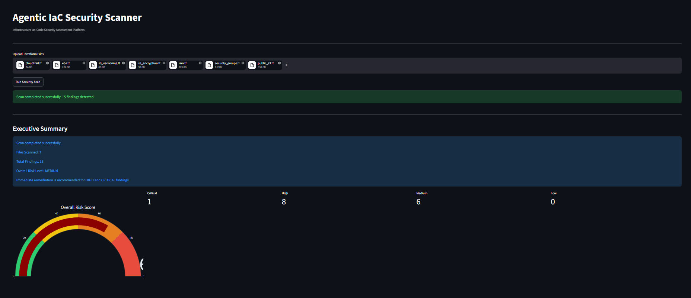
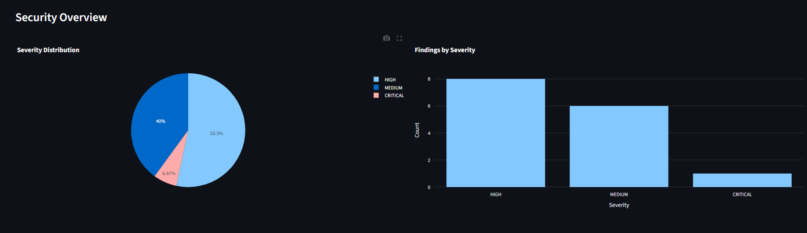
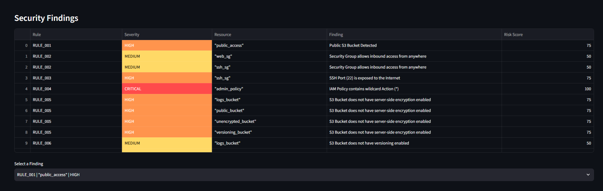
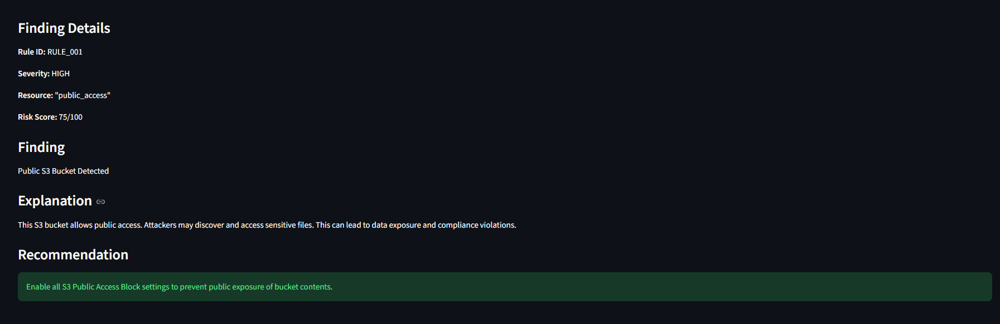
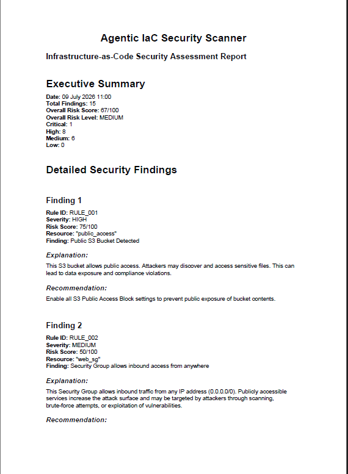
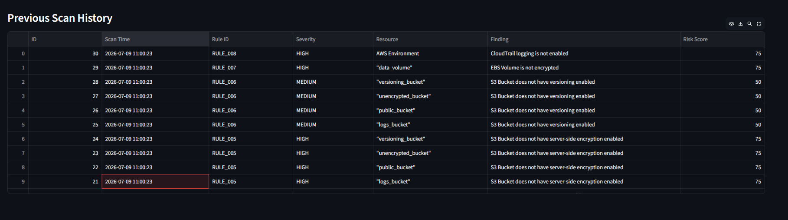

# Agentic Detection, Risk Assessment and Mitigation of Infrastructure-as-Code (IaC) Security Misconfigurations

An automated Infrastructure-as-Code (IaC) security analysis platform that detects Terraform security misconfigurations, evaluates risk, generates explainable findings, recommends remediation, maintains scan history, and produces professional security assessment reports.

---

## Overview

Infrastructure-as-Code enables rapid cloud provisioning but also introduces security risks when infrastructure is misconfigured.

This project automatically analyzes Terraform configurations to identify cloud security misconfigurations before deployment. It performs rule-based detection, calculates risk scores, explains why each issue is dangerous, recommends remediation steps, stores scan history, and generates downloadable PDF security assessment reports through an interactive Streamlit dashboard.

---

## Features

- Terraform (.tf) file parsing
- Resource extraction
- Rule-based security detection
- Risk scoring engine
- Explainable security analysis
- Automated remediation recommendations
- Interactive Streamlit dashboard
- Executive summary and risk visualization
- PDF security assessment report generation
- SQLite scan history
- Multi-file Terraform project scanning

---

## Detection Rules

| Rule ID | Description | Severity |
|----------|-------------|----------|
| RULE_001 | Public S3 Bucket | HIGH |
| RULE_002 | Open Security Group | MEDIUM |
| RULE_003 | Public SSH (Port 22) | HIGH |
| RULE_004 | IAM Wildcard Policy | CRITICAL |
| RULE_005 | Missing S3 Encryption | HIGH |
| RULE_006 | Missing S3 Versioning | MEDIUM |
| RULE_007 | Unencrypted EBS Volume | HIGH |
| RULE_008 | Missing CloudTrail Logging | HIGH |

---

## Technology Stack

- Python
- Streamlit
- SQLite
- Plotly
- Pandas
- python-hcl2
- ReportLab
- Terraform

---

## System Architecture

```
Terraform Files
        │
        ▼
Terraform Parser
        │
        ▼
Resource Extractor
        │
        ▼
Detection Engine
        │
        ▼
Risk Assessment Engine
        │
        ▼
Explainability Engine
        │
        ▼
Recommendation Engine
        │
        ▼
SQLite Database
        │
        ▼
Streamlit Dashboard
        │
        ▼
PDF Report Generator
```

---

## Dashboard

### Dashboard Overview



---

### Risk Analytics



---

### Security Findings



---

### Finding Details



---

### PDF Security Report



---

### Scan History



---

## Folder Structure

```
agentic-iac-security/

├── parser/
├── detection/
├── risk/
├── explainability/
├── remediation/
├── dashboard/
├── database/
├── reports/
├── terraform_samples/
├── evaluation/
├── docs/
├── assets/
├── app.py
├── requirements.txt
└── README.md
```

---

## Installation

Clone the repository

```bash
git clone https://github.com/YOUR_USERNAME/agentic-iac-security.git
```

Move into the project

```bash
cd agentic-iac-security
```

Install dependencies

```bash
pip install -r requirements.txt
```

Run the dashboard

```bash
streamlit run app.py
```

---

## Workflow

1. Upload Terraform files.
2. Run the security scan.
3. Review identified security findings.
4. Analyze risk scores.
5. Read detailed explanations.
6. Review remediation recommendations.
7. Download the PDF report.
8. View historical scan records.

---

## Evaluation

| Metric | Result |
|---------|---------|
| Detection Rules | 8 |
| Detection Accuracy | 100% |
| Dashboard | Successful |
| PDF Report Generation | Successful |
| SQLite Logging | Successful |

---

## Future Enhancements

- Support for Azure and GCP Terraform resources
- Additional Terraform security rules
- CIS AWS Benchmark mapping
- MITRE ATT&CK integration
- CVSS scoring
- GitHub Actions integration
- CI/CD security scanning
- Cloud deployment support

---

## Author

Developed as a Cybersecurity Capstone Project.
